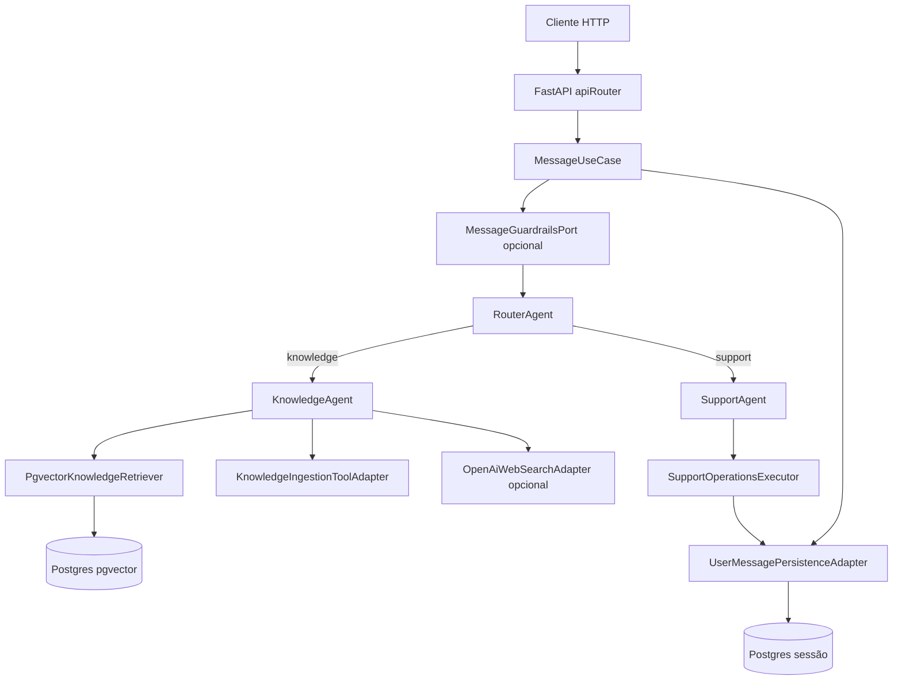

# Agent Swarm Backend

Backend **InfinitePay Agent Swarm** em arquitetura hexagonal (ports & adapters): um único endpoint de mensagens orquestra **roteamento**, **agente de conhecimento (RAG + busca web opcional)** e **agente de suporte (ferramentas sobre Postgres de sessão)**, com persistência de turnos, identidade Google opcional e **guardrails** configuráveis.

## Visão da arquitetura



- **Domínio** (`app/domain/`): modelos imutáveis, ports, erros — sem dependência de frameworks.
- **Aplicação** (`app/application/`): `MessageUseCase`, agentes, executor de operações de suporte.
- **Adaptadores** (`app/adapters/`): HTTP inbound, OpenAI, Google, Postgres.
- **Infra** (`app/infra/rag_pipeline/`): fetch, chunk, embed, CLI de migração/ingestão/consulta.

## Fluxo de uma mensagem (`POST /messages`)

1. Validação do JSON (`message`, `userId`, `googleIdToken` opcional).
2. Se houver token Google: verificação e chave de conversa `google:<subject>`; senão `guest:<userId>`.
3. Carregamento do histórico do dia (mesma chave) e montagem do texto contextual (`Histórico…` + `Mensagem atual do usuário`).
4. **Guardrails de entrada** (se `GUARDRAILS_MODE=rules`): bloqueio, truncagem ou seguir.
5. **RouterAgent** → rota `knowledge` ou `support` (ou resposta estática se roteador degradado).
6. Agente especializado; no suporte, `SupportOperationsExecutor` aplica `profile_patch` / `delete_turns` / `noop` no escopo da chave.
7. **Guardrails de saída** (mesmo port, se configurado).
8. Persistência do turno (`user_request`, `model_answer`, rota, `trace_id`, etc.).
9. Resposta: `{ "status": "ok"|"degraded", "reply": "…", "traceId": "<uuid>" }`.

## Agentes

| Agente | Função |
|--------|--------|
| **RouterAgent** | Classifica a mensagem em `knowledge` ou `support` via LLM (JSON); em falha parsing/ modelo, degrada com resposta segura. |
| **KnowledgeAgent** | RAG (pgvector), ingestão opcional por URL, resposta fundamentada; se configurado, **busca web** (OpenAI Responses API) quando RAG fraco ou sem trechos. |
| **SupportAgent** | LLM em JSON (`assistant_reply` + `operations`): ferramentas **profile_patch**, **delete_turns** (escopos `all`, `by_trace_ids`, `by_turn_ids`), **noop**. Dados em `conversation_profiles` e `user_message_turns`. |

Comunicação entre agentes: **chamadas síncronas** no `MessageUseCase` (sem fila).

## API HTTP

### `GET /health`

Resposta: `{ "status": "ok" }`.

### `POST /messages`

**Corpo (JSON):**

```json
{
  "message": "texto não vazio",
  "userId": "identificador estável do cliente",
  "googleIdToken": "opcional"
}
```

**Resposta 200:**

```json
{
  "status": "ok",
  "reply": "texto para o usuário",
  "traceId": "uuid"
}
```

`status` pode ser `degraded` quando o roteador ou guardrails marcam degradação.

**Erros comuns:** `422` (validação), `401` (token Google inválido), `503` / `504` (dependências).

OpenAPI: `/docs`, `/redoc`.

## Variáveis de ambiente (resumo)

| Variável | Uso |
|----------|-----|
| `OPENAI_API_KEY` | OpenAI (chat, embeddings, web search). |
| `DATABASE_URL` | Postgres **RAG** (pgvector). |
| `SESSION_DATABASE_URL` | Postgres **sessão** (turnos, perfis). |
| `ROUTER_MODEL`, `KNOWLEDGE_MODEL`, `SUPPORT_MODEL`, `WEB_SEARCH_MODEL` | Modelos por etapa (defaults no código/Compose). |
| `GOOGLE_CLIENT_ID` | Habilita verificação de `googleIdToken`. |
| `EMBEDDING_PROVIDER` | `openai` ou `deterministic` (testes). |
| `GUARDRAILS_MODE` | `off` ou `rules`; com `rules`, ver `GUARDRAILS_INPUT_BLOCK_SUBSTRINGS`, `GUARDRAILS_OUTPUT_BLOCK_SUBSTRINGS`, `GUARDRAILS_MAX_INPUT_CHARS`. |

Para integração local com DB de teste: `RAG_TEST_DATABASE_URL`, `SESSION_TEST_DATABASE_URL` (opcional; sessão pode usar default local — ver testes).

## Docker

**Primeiro deploy** (índice RAG vazio):

```bash
docker compose up -d postgres session_postgres
docker compose -f docker-compose.yml -f docker-compose.rag-seed.yml run --rm rag_seed
docker compose up -d
```

**Dia a dia:**

```bash
docker compose up --build
```

- API: `http://localhost:8000`
- Imagem aplica migrações RAG + sessão no startup; **ingestão em massa** não roda no CMD — use `rag_seed` ou CLI (abaixo).

Apenas Docker (sem Compose completo): é necessário Postgres acessível em `DATABASE_URL` / `SESSION_DATABASE_URL` e pipeline RAG preparado antes de depender do Knowledge.

## Pipeline RAG

- **Manifesto de URLs:** `app/infra/rag_pipeline/seedUrls.json` (páginas InfinitePay do desafio).
- **CLI** (na raiz do repo, com venv e `DATABASE_URL`):

```bash
python -m app.infra.rag_pipeline.cli migrate
python -m app.infra.rag_pipeline.cli ingest --crawl-version <rótulo>
python -m app.infra.rag_pipeline.cli add-url --url "https://..." --crawl-version <rótulo>
python -m app.infra.rag_pipeline.cli query --query "..." --top-k 3 --pretty
```

- **Sessão / mensagens:**

```bash
python -m message_persistence.cli migrate
```

## Persistência de sessão

- **`user_message_turns`:** uma linha por turno; `conversation_owner_key`, `trace_id`, `turn_id`, texto usuário/assistente, rota.
- **`conversation_profiles`:** nome e metadados por chave de conversa (ferramentas de suporte).
- **`app_users`:** utilizadores Google (quando autenticado).

## Estratégia de testes

- **`tests/routes/`:** contratos HTTP com `TestClient` e doubles in-process (sem DB, sem OpenAI) — health, envelope de `/messages`, rota support, `422`.
- **`tests/integration/`:** orquestração e falhas de API (`test_api_orchestration.py`, `test_api_failure_paths.py`); persistência Postgres real quando variáveis de ambiente estão definidas; RAG opcional com `RAG_TEST_DATABASE_URL`.
- **Unitários:** parsers (roteador, suporte, web), guardrails, executor de suporte, agente de conhecimento com doubles.
- **Smoke (`tests/smoke/`):** scripts contra API/container real (Docker, OpenAI conforme script).

### Comandos

```bash
pip install -r requirements.txt
pytest tests/routes -q
pytest tests/integration -q
pytest -q
```

Testes de integração marcados com `@pytest.mark.integration` que exigem DB podem ser filtrados com `-m integration`.

## Scripts smoke (API / RAG / suporte)

| Script | Objetivo |
|--------|----------|
| `tests/smoke/smokeDocker.sh` / `.ps1` | `/health`, `/messages`, payload inválido → 422 |
| `tests/smoke/smokeKnowledgeAgent.sh` / `.ps1` | Knowledge com rota forçada + RAG em container |
| `tests/smoke/smokeRagPipeline.sh` / `.ps1` | CLI RAG migrate / ingest / query |
| `tests/smoke/smokeWebSearch.sh` / `.ps1` | Pergunta que pode acionar busca web |
| `tests/smoke/smokeSupportProfilePatch.sh` / `.ps1` | Router real → suporte → perfil |
| `tests/smoke/smokeSupportDeleteTurns.sh` / `.ps1` | Router real → suporte → delete_turns |
| `tests/smoke/smokeOpenAiConnection.py` | Chave OpenAI válida |

Defina `BASE_URL` se a API não estiver em `http://localhost:8000`.

## Uso de LLM e ferramentas

- **Roteamento e suporte:** `OpenAiChatAdapter` (chat completions, JSON).
- **Conhecimento:** mesmo adapter para formatar resposta JSON a partir de trechos RAG; opcionalmente **web search** via API de respostas OpenAI.
- **Embeddings RAG:** configurável (`text-embedding-3-small` em produção típica).
- **Suporte:** o modelo devolve JSON estruturado; o backend **não** envia HTTP externo dentro do agente — só o executor fala com Postgres.

## Documentação adicional

- **`CHANGELOG.md`:** histórico de mudanças.
- **`app/README.md`:** atalhos para validação manual, PowerShell e CLI.

## Repositório e licença

Projeto de desafio técnico (Cloudwalk / InfinitePay). Ajuste políticas de commit/CI conforme a equipa.
