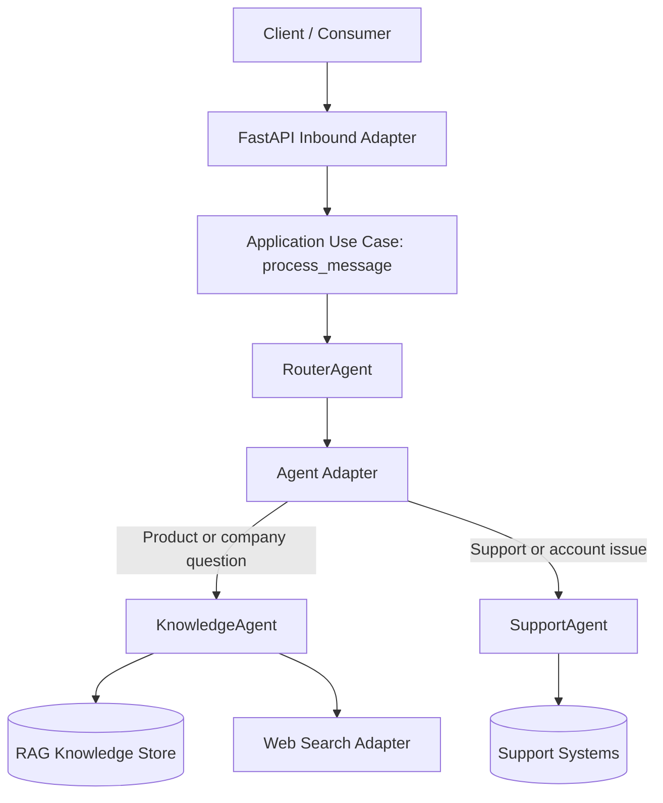

# Agent-Swarm-Backend
Hexagonal Agent Swarm made to simulate a production ready setup. Part of the Cloudwalk challenge.

## Rough Draft

### Infrastructure Flowchart



### Brief technical and route overview

This project follows a hexagonal architecture where FastAPI is only an inbound adapter. The API layer validates payloads and forwards work to the application use case (`process_message`), while routing logic and agent behavior stay inside the core.

The `RouterAgent` orchestrates specialized agents:
- `KnowledgeAgent` handles product/company queries using RAG and optional web search.
- `SupportAgent` handles support/account flows through the shared agent adapter.

Planned HTTP routes:
- `POST /messages`: accepts `{ "message": "<text>", "userId": "<id>" }` and returns a normalized JSON payload.
- `GET /health`: returns service health status for operational checks.

### Docker setup

Run with Docker Compose:

```bash
docker compose up --build
```

Run with Docker only:

```bash
docker build -t agent-swarm-backend .
docker run --rm -p 8000:8000 agent-swarm-backend
```

After startup:
- API base URL: `http://localhost:8000`
- Health endpoint: `http://localhost:8000/health`
- OpenAPI docs: `http://localhost:8000/docs`

## (Disclaimer)

This is a preliminary plan, not indicative of current or future implementation formats.
