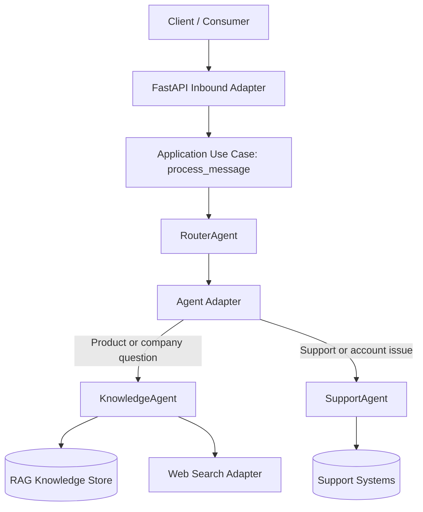

# Agent-Swarm-Backend
Hexagonal Agent Swarm made to simulate a production ready setup. Part of the Cloudwalk challenge.

## Rough Draft

### Infrastructure Flowchart



### Brief technical and route overview

This project follows a hexagonal architecture where FastAPI is only an inbound adapter. The API layer validates payloads and forwards work to the application use case (`process_message`), while routing logic and agent behavior stay inside the core.

The `RouterAgent` orchestrates specialized agents:
- `KnowledgeAgent` handles product/company queries using RAG and optional web search.
- `SupportAgent` handles support/account flows through the shared agent adapter.

KnowledgeAgent behavior now supports two modes through the same hexagonal pipeline:
- **Knowledge answer mode**: retrieves grounded chunks from pgvector and answers with source-aware context.
- **Context update mode**: accepts direct URL add requests (structured tool call or natural-language request) and ingests the URL into the RAG store.

Knowledge answer generation now uses a dedicated model configuration independent from routing:
- `ROUTER_MODEL`: decides which agent route handles the message.
- `KNOWLEDGE_MODEL`: formats grounded knowledge answers from retrieved RAG chunks.

Planned HTTP routes:
- `POST /messages`: accepts `{ "message": "<text>", "userId": "<id>" }` and returns a normalized JSON payload.
- `GET /health`: returns service health status for operational checks.

### Docker setup

Run with Docker Compose:

```bash
docker compose up --build
```

Run with Docker only:

```bash
docker build -t agent-swarm-backend .
docker run --rm -p 8000:8000 agent-swarm-backend
```

After startup:
- API base URL: `http://localhost:8000`
- Health endpoint: `http://localhost:8000/health`
- OpenAPI docs: `http://localhost:8000/docs`

### RAG pipeline (Postgres + pgvector)

This repository includes a standalone RAG ingestion pipeline that is intentionally separate from API startup.
It stores chunked, versioned knowledge data in PostgreSQL with pgvector support.

RAG storage service:

```bash
docker compose up -d postgres
```

Run migrations:

```bash
python -m app.rag_pipeline.cli migrate
```

Seed URL manifest lives at `app/rag_pipeline/seedUrls.json`.

Run ingestion from the JSON base URLs:

```bash
python -m app.rag_pipeline.cli ingest --crawl-version 20260429
```

Rerun/reindex pipeline:

```bash
python -m app.rag_pipeline.cli reindex --crawl-version 20260429-r2
```

Ingest one specific URL (research-agent style):

```bash
python -m app.rag_pipeline.cli add-url --url "https://www.infinitepay.io/pix" --crawl-version 20260429-r3
```

Structured tool-call equivalent (future agent integration):

```bash
python -m app.rag_pipeline.cli add-url --url "https://example.com/new-context"
```

Run a retrieval check:

```bash
python -m app.rag_pipeline.cli query --query "phone as a card machine" --top-k 3 --pretty
```

Optional one-off ingestion container:

```bash
docker compose --profile rag run --rm rag_ingest
```

Compose-driven RAG command modes:

```bash
# 1) Database setup / bulk seed from app/rag_pipeline/seedUrls.json (default mode)
docker compose --profile rag run --rm \
  -e RAG_PIPELINE_COMMAND=ingest \
  -e RAG_PIPELINE_ARGS="--crawl-version 20260429" \
  rag_ingest

# 2) Future research-agent trigger: ingest one URL directly
docker compose --profile rag run --rm \
  -e RAG_PIPELINE_COMMAND=add-url \
  -e RAG_PIPELINE_ARGS="--url https://www.infinitepay.io/pix --crawl-version 20260429-rurl" \
  rag_ingest
```

### RAG smoke routines

PowerShell:

```powershell
powershell -ExecutionPolicy Bypass -File tests/smoke/smokeRagPipeline.ps1
```

Bash:

```bash
bash tests/smoke/smokeRagPipeline.sh
```

KnowledgeAgent smoke routines:

```powershell
powershell -ExecutionPolicy Bypass -File tests/smoke/smokeKnowledgeAgent.ps1
```

```bash
bash tests/smoke/smokeKnowledgeAgent.sh
```

## (Disclaimer)

This is a preliminary plan, not indicative of current or future implementation formats.
