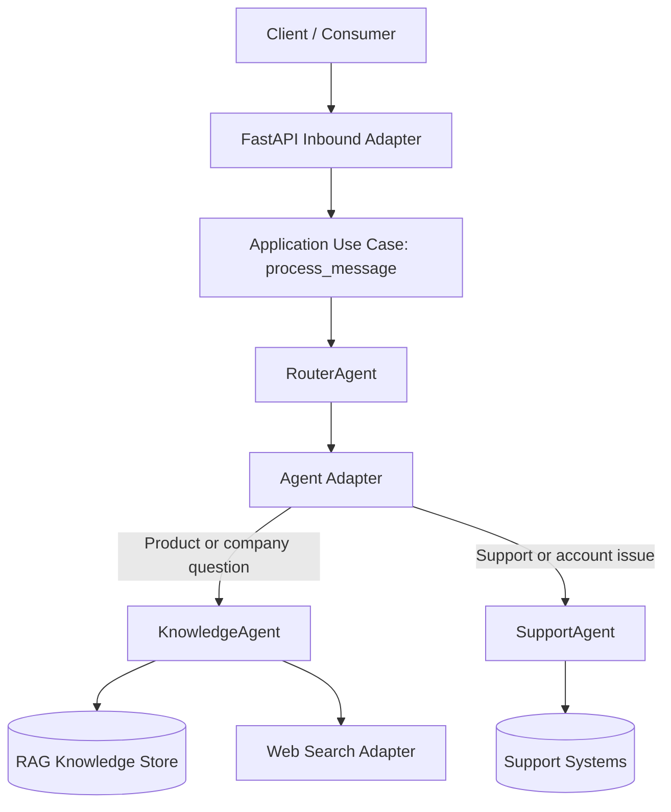

# Agent-Swarm-Backend
Hexagonal Agent Swarm made to simulate a production ready setup. Part of the Cloudwalk challenge.

## Rough Draft

### Infrastructure Flowchart



### Brief technical and route overview

This project follows a hexagonal architecture where FastAPI is only an inbound adapter. The API layer validates payloads and forwards work to the application use case (`process_message`), while routing logic and agent behavior stay inside the core.

The `RouterAgent` orchestrates specialized agents:
- `KnowledgeAgent` handles product/company queries using RAG and optional web search.
- `SupportAgent` handles support/account flows through the shared agent adapter.

KnowledgeAgent behavior now supports two modes through the same hexagonal pipeline:
- **Knowledge answer mode**: retrieves grounded chunks from pgvector and answers with source-aware context.
- **Context update mode**: accepts direct URL add requests (structured tool call or natural-language request) and ingests the URL into the RAG store.

Knowledge answer generation now uses a dedicated model configuration independent from routing:
- `ROUTER_MODEL`: decides which agent route handles the message.
- `KNOWLEDGE_MODEL`: formats grounded knowledge answers from retrieved RAG chunks.

Planned HTTP routes:
- `POST /messages`: accepts `{ "message": "<text>", "userId": "<id>", "googleIdToken": "<optional>" }` and returns a normalized JSON payload with `reply`, `traceId`, and `status`; every turn persists `user_request` and `model_answer` (plus routed agent labels and timestamps) keyed by guest user label or authenticated Google subject.
- `GET /health`: returns service health status for operational checks.

### Docker setup

Compose starts **Postgres**, **session Postgres**, and the **API** only. Applying RAG DDL and **loading seed chunks** is a **separate one-shot** invoked with the bundled merge file.

**First deploy (fresh `postgres_data` volume or empty RAG index):**

```bash
docker compose up -d postgres session_postgres
docker compose -f docker-compose.yml -f docker-compose.rag-seed.yml run --rm rag_seed
docker compose up -d
```

Repeat **`rag_seed`** after wiping the Postgres volume or whenever you want to reload `RAG_SEED_URLS_PATH` (see **`docker-compose.rag-seed.yml`**). To pass extra CLI flags (e.g. **`--crawl-version`**), either run **`migrate`** / **`ingest`** manually or adjust the **`command:`** block in **`docker-compose.rag-seed.yml`**.

Alternatively run **`python -m app.infra.rag_pipeline.cli migrate`** then **`python -m app.infra.rag_pipeline.cli ingest`** locally (venv) against **`DATABASE_URL`** — same pipeline as **`rag_seed`**.

**Container image CMD** applies **RAG + user-message SQL migrations only** (no ingestion). Plain **`docker run`** without Compose still needs Postgres on the **`DATABASE_URL`** host and **`rag_seed`** (or **`migrate`** + **`ingest`**) executed once before relying on **`KnowledgeAgent`**.

Run with Docker Compose (after seed when needed):

```bash
docker compose up --build
```

Runtime environment split:
- `DATABASE_URL`: RAG Postgres database.
- `SESSION_DATABASE_URL`: dedicated Postgres volume for authenticated `app_users` and per-turn `user_message_turns`.
- `GOOGLE_CLIENT_ID`: audience expected when validating Google ID tokens for authenticated `/messages` calls.

Compose mounts named volumes **`postgres_data`** (RAG) and **`session_postgres_data`** (user messages).

Run with Docker only:

```bash
docker build -t agent-swarm-backend .
docker run --rm -p 8000:8000 agent-swarm-backend
```

After startup:
- API base URL: `http://localhost:8000`
- Health endpoint: `http://localhost:8000/health`
- OpenAPI docs: `http://localhost:8000/docs`

### RAG pipeline (Postgres + pgvector)

This repository includes a standalone RAG ingestion pipeline that is intentionally separate from API startup.
It stores chunked, versioned knowledge data in PostgreSQL with pgvector support.

RAG storage service:

```bash
docker compose up -d postgres
```

Session Postgres (user/message persistence):

```bash
docker compose up -d session_postgres
```

User message persistence model:
- `app_users`: Google profile rows keyed by Google subject (`google_subject`).
- `user_message_turns`: stores every exchange with `conversation_owner_key` (`guest:<userId>` or `google:<subject>`), `client_user_label`, `user_request`, `model_answer`, `routed_agent`, `trace_id`, timestamps, and optionally `user_id`.
- Sessions are a UI concept only—there is **no finalize endpoint**.

Each `/messages` call loads persisted same-day turns for the same logical user (guest label or authenticated subject) before routing.

Run migrations:

```bash
python -m app.infra.rag_pipeline.cli migrate
python -m message_persistence.cli migrate
```

Seed URL manifest lives at `app/infra/rag_pipeline/seedUrls.json`.

Run ingestion from the JSON base URLs:

```bash
python -m app.infra.rag_pipeline.cli ingest --crawl-version 20260429
```

Rerun/reindex pipeline:

```bash
python -m app.infra.rag_pipeline.cli reindex --crawl-version 20260429-r2
```

Ingest one specific URL (research-agent style):

```bash
python -m app.infra.rag_pipeline.cli add-url --url "https://www.infinitepay.io/pix" --crawl-version 20260429-r3
```

Structured tool-call equivalent (future agent integration):

```bash
python -m app.infra.rag_pipeline.cli add-url --url "https://example.com/new-context"
```

Run a retrieval check:

```bash
python -m app.infra.rag_pipeline.cli query --query "phone as a card machine" --top-k 3 --pretty
```

Compose RAG jobs (optional):

- **First seed / empty index** — merge **`docker-compose.rag-seed.yml`** and **`run rag_seed`** (`migrate` + default `ingest` from the manifest). Matches the [Docker setup](#docker-setup) first-deploy flow.
- **Flexible one-off** — **`docker compose --profile rag run --rm rag_ingest`** (sets **`RAG_PIPELINE_COMMAND`** / **`RAG_PIPELINE_ARGS`**):

```bash
# Bulk ingest with explicit crawl label (example)
docker compose --profile rag run --rm \
  -e RAG_PIPELINE_COMMAND=ingest \
  -e RAG_PIPELINE_ARGS="--crawl-version 20260429" \
  rag_ingest

# Shorthand: default is also `ingest`
docker compose --profile rag run --rm rag_ingest

# One URL
docker compose --profile rag run --rm \
  -e RAG_PIPELINE_COMMAND=add-url \
  -e RAG_PIPELINE_ARGS="--url https://www.infinitepay.io/pix --crawl-version 20260429-rurl" \
  rag_ingest
```

### RAG smoke routines

PowerShell:

```powershell
powershell -ExecutionPolicy Bypass -File tests/smoke/smokeRagPipeline.ps1
```

Bash:

```bash
bash tests/smoke/smokeRagPipeline.sh
```

KnowledgeAgent smoke routines:

```powershell
powershell -ExecutionPolicy Bypass -File tests/smoke/smokeKnowledgeAgent.ps1
```

```bash
bash tests/smoke/smokeKnowledgeAgent.sh
```

## (Disclaimer)

This is a preliminary plan, not indicative of current or future implementation formats.
